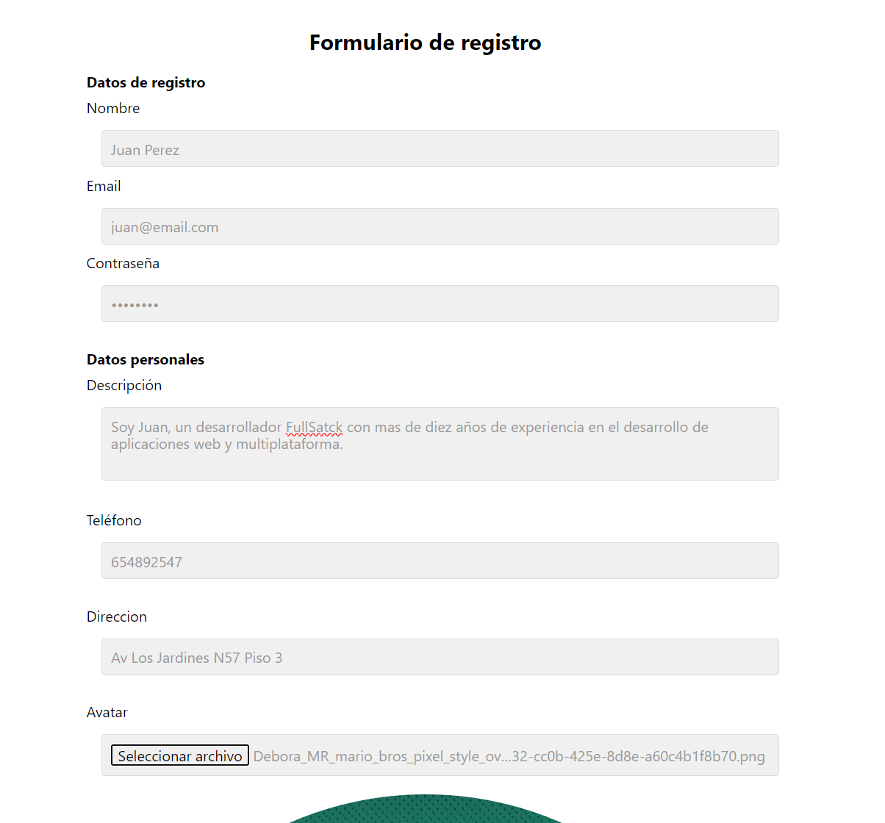
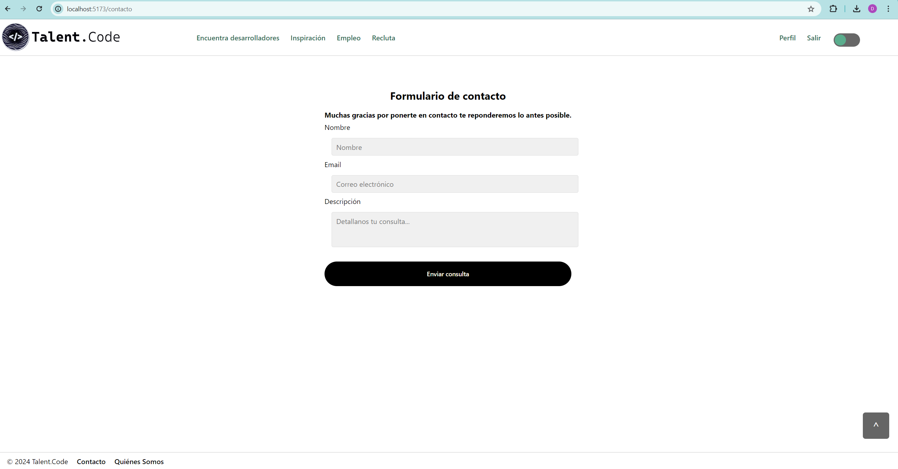

# Manual de Usuario: Talent.Code

Bienvenido al manual de usuario de Talent.Code. Esta guía le ayudará a navegar y utilizar todas las funcionalidades de la aplicación web. El objetivo es proporcionar una plataforma minimalista y elegante, donde tanto desarrolladores como empresas puedan interactuar y encontrar las mejores oportunidades laborales.

## Índice

1. [Inicio de Sesión y Registro](#inicio-de-sesión-y-registro)
2. [Perfil de Desarrollador](#perfil-de-desarrollador)
3. [Proyectos](#proyectos)
4. [Perfil de Empresa](#perfil-de-empresa)
5. [Recluta](#recluta)
6. [Matchmaking](#matchmaking)
7. [Listas de Vacantes y Desarrolladores](#listas-de-vacantes-y-desarrolladores)
8. [Soporte y Ayuda](#soporte-y-ayuda)

## Inicio de Sesión y Registro

Esta es la página principal de Talent.code desde la cuel tenemos acceso sin necesidad de loguearnos a diferentes secciones.

### Registro de Desarrolladores
1. Acceda a la página de inicio.

2. Haga clic en "Registrarse" y seleccione "Desarrollador".

3. Complete el formulario con sus datos de registro y su información personal,
 
4. Haga clic en "Registrarse".
5. Ahora seras redireccionado al perfil.

 Donde podras terminar de rellenar la experiencia laboral, formación y lenguajes de programación que domina.

6. Añada enlaces a su perfil de GitHub o GitLab.

7. Haga clic en "Añadir".

### Registro de Empresas
1. Acceda a la página de inicio.

2. Haga clic en "Registrarse" y seleccione "Empresa".

3. Complete el formulario con la información de su empresa.

4. Haga clic en "Registrarse".

5. Sera redireccionado hacia su perfil donde podra visualizar como se veran publicamente sus datos.

### Inicio de Sesión
1. Acceda a la página de inicio.

2. Haga clic en "Iniciar Sesión".

3. Introduzca su correo electrónico y contraseña.

4. Haga clic en "Entrar".

## Perfil de Desarrollador

### Visualización del Perfil
- Acceda a su perfil desde el menú de navegación.

- Aquí podrá ver y editar su información personal, experiencia laboral, formación y lenguajes de programación.

### Edición del Perfil
1. Haga clic en "Información personal".

2. Modifique los campos necesarios.
3. Haga clic en "Guardar Cambios".

## Proyectos

### Añadir Proyectos
1. Vaya a la sección "Historial Académico/Profesional" desde su perfil.

2. Haga clic en "Agregar Proyecto".

3. Complete la información del proyecto, incluyendo imágenes y enlaces.

4. Haga clic en "Guardar" o "Cancelar" en caso de que no desees seguir.

### Visualización de Proyectos
- Los proyectos se mostrarán en el perfil público del desarrollador y en el Portfolio.

## Perfil de Empresa

### Visualización del Perfil
- Acceda a su perfil desde el menú de navegación.

- Aquí podrá ver su perfil público y las vacantes disponibles en su empresa.

## Recluta

### Para Empresas
1. Una vez logueado como empresa desde la barra de navegacion acceda a "Recluta"

2. Ahí podra abrir una nueva vacante y visualizar las vacantes activas.

### Crear una vacante
1. Rellene los datos de la vacante.

2. Elija entre una o varias tecnologías pulsando la tecla Ctrl

3. Pulse en crear vacante.

4. Ahora podra visualizar su nueva vacante

## Matchmaking

### Para Desarrolladores
1. Complete el formulario de registro con sus habilidades y preferencias laborales.
2. Acceda a la sección "Match" para ver vacantes que se ajusten a su perfil.

3. Aqui podra observar sobre un porcentaje cuanto se ajusta la oferta a tus requerimientos.

## Listas de Vacantes y Desarrolladores

### Desarrolladores
- Acceda a la sección "Empleo" para ver una lista de oportunidades laborales.

- Use los filtros disponibles para ajustar la búsqueda a sus preferencias.

### Empresas
- Acceda a la sección "Encuentra desarrolladores" para ver una lista de candidatos potenciales.

- Use los filtros disponibles para ajustar la búsqueda a sus necesidades.

## Soporte y Ayuda

- Si necesita ayuda, puede acceder a la sección "Contacto" desde el menú de navegación en el footer.

- Desde ahi podra acceder al formulario de contacto.

¡Gracias por utilizar nuestra plataforma! Esperamos que esta guía le sea de ayuda para sacar el máximo provecho de su experiencia en nuestro Portafolio Digital para Desarrolladores y Programadores.